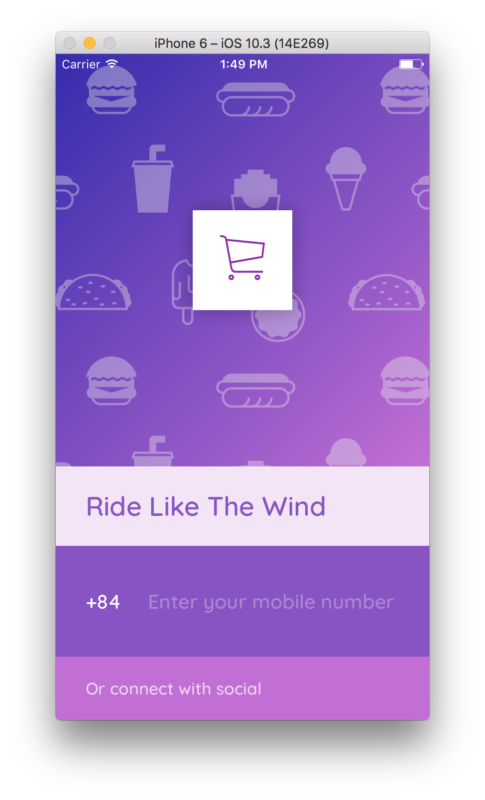

# Pavement Shop
> An ecommerce application created for greateness 🍭.


## Technology
- [React Native](https://facebook.github.io/react-native/)
  + [React Navigation](https://reactnavigation.org/)
- [Redux](redux.js.org)

## Installation
This app was wrapped using Native Code of React Native. Install the React Native CLI, follow the official Getting Started [here](https://facebook.github.io/react-native/docs/getting-started.html). Clone the repo, open it with any [code](blog.bkdev.me/2017/04/11/vscode.html) editors and you are ready to have fun 🍟.

```
$ yarn
$ yarn start
$ react-native run-ios
$ react-native run-android
```

## Contribution
This app is in development stage, but I will be so happy if anyone makes issues or pull requests, you are so welcome 🍦.

## About
- Contact: [Quoc Khanh](https://facebook.com/bkdev98).
- [FU Mobile Challenge](https://www.facebook.com/FUMobileChallenge/)